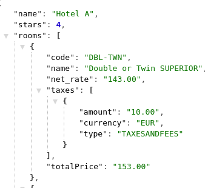

# Trivago Pre-Interview Task
-  I've used Laravel to implement an API endpoint that returns a JSON response contains a list of hotel
   rooms fetched from different data sources (Advertisers) sorted (cheapest to most expensive) without duplicating.

# Perquisite
- `Docker`  
- `docker-compose`
- `Makefile`

# Dev-Ops Description :
- Docker & docker-compose. 
- register services  ``php-fpm ``, ``nginx``
- Link each service to service registry .
- use ``make`` command to automate operations

# Install
- extract the .zip file or download using `git clone https://khaledsabbah@bitbucket.org/khaledsabbah/trivago.git`
- `cd trivago` <small> ( go to task location )</small>
- `make init`
- `make install permission`
- You should see the following image


- To Open docker container use the following command 
    
        docker exec -it phpfpm /bin/bash
        
#Running
*        Base Url :   http://localhost:8089
######Sort Hotels' Rooms In Ascending Order API<SMALL> ( cheapest to expensive )</SMALL> :
*       http://localhost:8089/api/v1/hotels  
*       http://localhost:8089/api/v1/hotels?sort=1  
######Sort Hotels' Rooms In Descending Order API<SMALL> ( expensive to cheapest )</SMALL> :
*       http://localhost:8089/api/v1/hotels?sort=0

# Test Cases:

- Run   `make test`
- Then, you'll see result like this:  

## Code Desgin and Architect
I tried to apply S.O.L.I.D principles & use some design pattern and Hydrate everything into object as possible.

#### Patterns used:
- ``Service Pattern``  Calling repository if any, retrieving data and aggregate multiple processes.
- ``Factory Pattern``   Create an Advertiser object on the fly .
- ``Hydrator Pattern``  Hydrate inputs ( eg. data ) into entities .
- ``Composite Entity Pattern``  Applying composition and relations between Entities.
- ``Filter Pattern``   Filter data and return only what meet the implemented criteria
- ``Transformer Pattern``  Transform response object to and JSONable type like Array .

##  Usage & steps to add new Advertiser or data source:
1. Add advertiser entry in `config/advertisers.php`.  <SMALL>ex:`flipkey`</SMALL>.
    >   retun [ 'airbnb' , 'booking' , `flipkey` ]
    
2. Inside `App\Advertisers`, Add advertiser class named as `Flipkey.php` <small> =>`ucfirst(flipkey)`</small> and must extend class ``AbstractAdvertiser``.
 
3. Inside `Flipkey.php`, Define 3 attributes that works as Mapper for API reposponse:
```php
        const API_URL = '<String containing API url>'; 
            ex: const API_URL= "https://f704cb9e-bf27-440c-a927-4c8e57e3bad1.mock.pstmn.io/s2/availability"
    
        protected $hotelKeys = ["<< Key Used In Code and Never Change That Key >> " => "API Reponse Key Mapper & changes Per Advertiser Response", ...];
            ex: protected $hotelKeys = ['name' => 'name', 'stars' => 'stars', 'rooms' => 'rooms'];
    
        protected $roomKeys = ["<< Key Used In Code and Never Changes >> " => "API Reponse Keys Mapper & changes Per Advertiser Response", ...];
            ex: protected $roomKeys = ['code' => 'code', 'name' => 'name', 'net_price' => 'net_rate', 'taxes' => 'taxes', 'total_price' => "totalPrice"];
            
```
Look at This Image 
        
4. Go to the browser and write endpoint url [http://localhost:8089/api/v1/hotels](http://localhost:8089/api/v1/hotels)
    > ```Note:  Even after adding advertiser classes, You can enable and disable them by removing them from config/advertisers.php ```

# WorkFlow
- `Controller` calls `Service` Method to fetch data
- `Hydrators` used to hydrate data using `Entities`.
- `Fitlers` used do our logic remove repeated rooms and sort hydrated objects 
- `Transformers` used to transform the result in the JSON Output.
